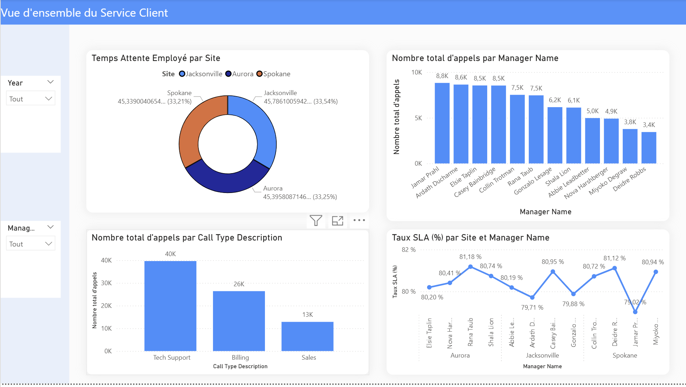
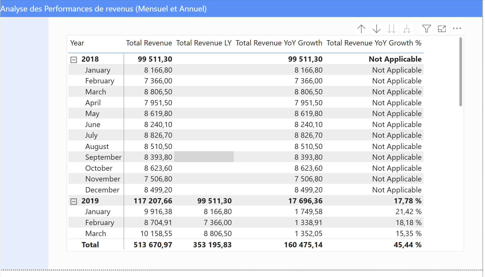
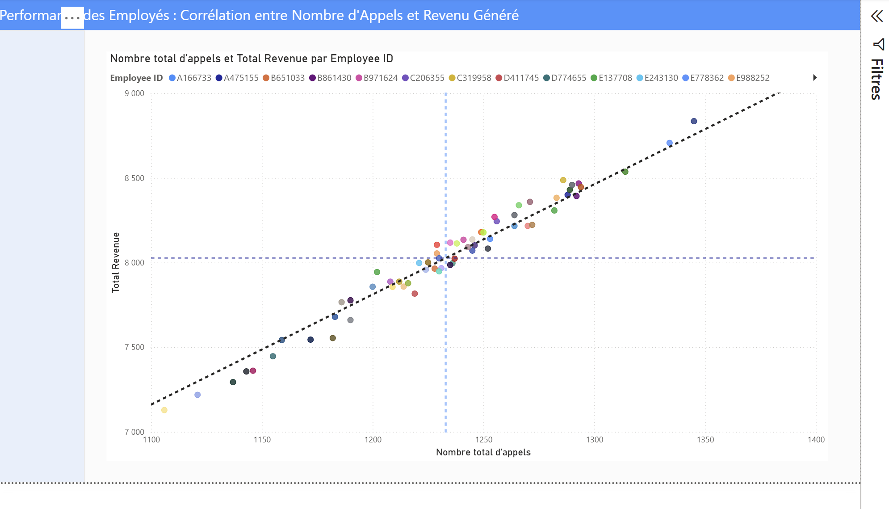
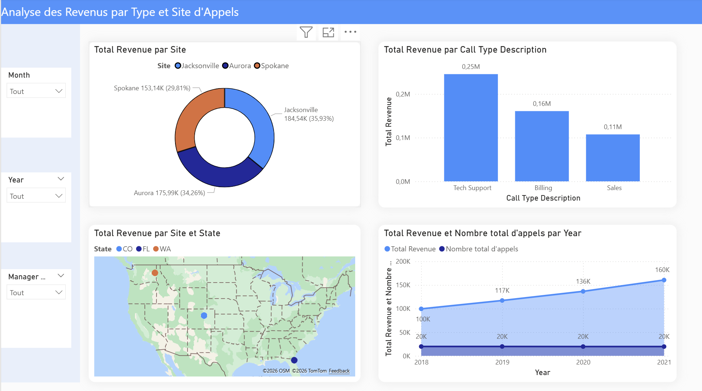

# Power BI – Call Center Performance Analysis

## 📌 Contexte
Projet personnel réalisé pour améliorer mes compétences en Power BI et analyser les performances d’un centre d’appels.  
L’objectif est d’identifier des insights business à partir des données et proposer des recommandations concrètes.

---

## 🎯 Objectifs du projet
- Analyser les revenus par type d’appel
- Étudier la corrélation entre volume d’appels et revenus
- Suivre l’évolution des revenus dans le temps
- Identifier les managers et sites les plus performants
- Proposer des recommandations business basées sur les résultats

---

## 🛠️ Outils utilisés
- **Power BI**
- **Power Query**
- **DAX**
- **Excel / CSV datasets**

---

## 📊 Dashboard Preview

  
  
  

---

## 📈 Principaux résultats
- Identification des périodes de forte performance
- Mise en évidence des types d’appels les plus rentables
- Analyse des managers et sites les plus efficaces
- Corrélation positive entre volume d’appels et revenus générés

---

## 💡 Recommandations Business
- Optimiser les équipes sur les types d’appels les plus rentables
- Renforcer les ressources pendant les périodes de forte demande
- Suivre les KPI SLA pour améliorer la satisfaction client
- Mettre en place un reporting mensuel automatisé avec Power BI

---

## 📂 Structure du projet
- `call-center-dashboard.pbix` → Dashboard Power BI
- `*.csv / *.xlsx` → Données utilisées
- `*.png` → Screenshots du dashboard

---

## 👨‍💻 Auteur
**Cliford Cupidon – Data Analyst**  
Python | SQL | Power BI | Excel  

LinkedIn : https://www.linkedin.com/in/ton-profil  
GitHub : https://github.com/Cliford-Cupidon

